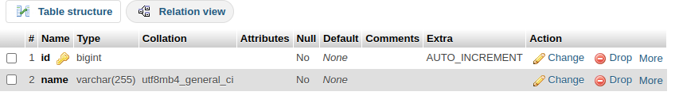
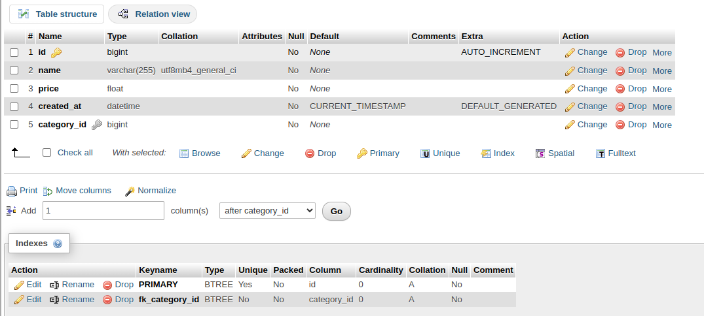
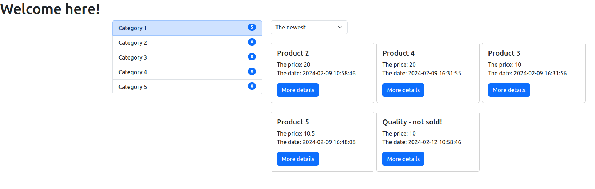

Hi there! This is simple e-commerce solution.

To set it up, you need Docker and docker-compose installed.

So, here are the steps to install and test the project locally: 

1. ``git clone``
2. ``docker compose up``
3. Go to `http://localhost:8091/` and login to phpMyAdmin, there are 2 users - `root`(password: superPass1!) and `admin` (password: rootSuperPass1!)
4. Now you should create a database ``ecommerce`` and 2 tables as shown bellow:

5. Fill the tables with data you like)
6. Go to ``http://localhost:8080/`` and see your categories and products. There are an example bellow, how it should look:

Also, there is a db script for building categories tree in `src/backend/db_script.php`.
Script should be executed from `php-fpm` docker container, so go there:

1. ``cd docker/``
2. ``docker exec -t -i docker-php-fpm-1 /bin/bash``
3. ``cd /var/www/html``
4. ``php db_script.php``